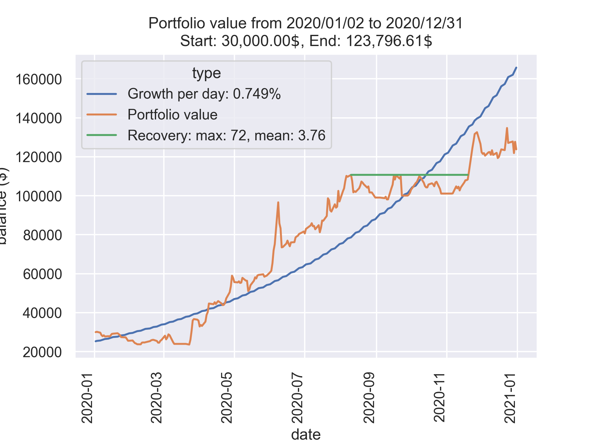
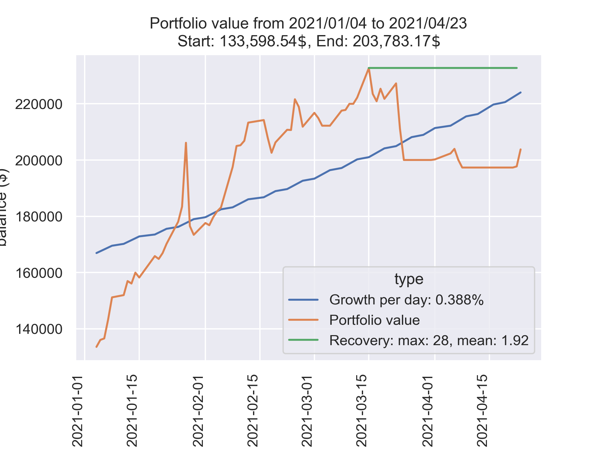

# stock_project

## Purpose:
The aim of this program is to generate a investment strategy, using a combination of classical statistics and machine learning.
Once every weekday a user should close all their open positions and rebuild their portfolio according to the recommendation. This can be done either manually or automatically, using the Alpaca API (see https://alpaca.markets/). The functionality to do so is included in the program.

## Results:
After some preprocessing on the previous day, a recommendation can be generated within 10 to 15 minutes.
Annual growth factor:
2013: 1.58
2020: 4.12
2021: 1.53
(To explain the differences: Hyperparameters (not just in the ML models, e.g. the way the strategy is chosen) were tuned to optimize the behaviour for 2020. Old data has worse quality than recent data: of the 2000 stocks analyzed for 2020 only 1000 have sufficient data for 2013.)

## How it works:
Every weekday the following tasks are performed:
- download the most recent hourly share prices for ~2000 stocks from polygon.io (see https://polygon.io/), and save it to the disk
- discard unneeded data, if there is missing data: fill the gaps using linear interpolation between the known prices
- choose a subset of stocks which meet certain quality criteria, like few missing data points
- generate training data from the data by compiling the data of 30 days into a single training point of dimension 104
- train the ensemble estimator, consisting of 10 composite estimators, each built from 3 neural nets with different tasks each, and a stochastic gradient descent regressor. In total there are 6 different neural net architectures and 30 neural nets involved.
- using the predictions of the ensemble estimator and statistical analysis, select 30 stocks and assign a percentage to each one
- visualize the simulated progression of the portfolio value that results from the generated strategies

## What I omitted in this version:
- the generation of training data (the raw data is modified to get input & response)
- the composition of the ensemble estimator and of the smaller building parts
- how the strategies are generated and how a strategy is selected

## Plots

