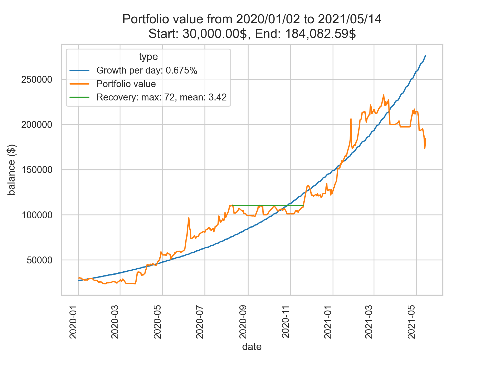

# stock_project

## Purpose:
The aim of this program is to generate a investment strategy, using a combination of classical statistics and machine learning.
Once every weekday a user should close all their open positions and rebuild their portfolio according to the recommendation. This can be done either manually or automatically, using the Alpaca API (see https://alpaca.markets/). The functionality to do so is included in the program.

## How it works:
Every weekday the following tasks are performed:
- download the most recent hourly share prices for ~2000 stocks from polygon.io (see https://polygon.io/), and save it to the disk
- discard unneeded data, if there is missing data: fill the gaps using linear interpolation between the known prices
- choose a subset of stocks which meet certain quality criteria, like few missing data points
- generate training data from the data by compiling the data of 30 days into a single training point of dimension 104
- train the ensemble estimator, consisting of 10 composite estimators, each built from 3 neural nets with different tasks each, and a stochastic gradient descent regressor. In total there are 6 different neural net architectures and 30 neural nets involved.
- using the predictions of the ensemble estimator and statistical analysis, select stocks and assign a percentage to each one
- visualize the simulated progression of the portfolio value that results from the generated strategies

## About the code:
The code is meant as a sample, and I removed certain parts and files. It is not meant to be executed.

## Plots/Results
The 20XX_summary.txt files give a detailed summary of all trade outcomes for that year.

The last plot above provides a comparison between the bot decisions, and randomly selecting and buying stocks as a baseline. It also introduces three new bot variants, which simply reject some of the decisions of the main bot, for example, if it didn't grow in the last 5 days.

The plot above shows results from an earlier version of the program.

## Challenges
I'm currently working on a way to reduce the huge drop that happens in 2014-2015. The suspected reason for this undesired behaviour are undetected share splits, which lead to wrong share prices (ie 10 shares become 1 share with 10x the value). Notice for example in the 2013-2015 plot, how sometimes the random strategies just randomly spike. This might have a huge impact on the ensemble estimator.
